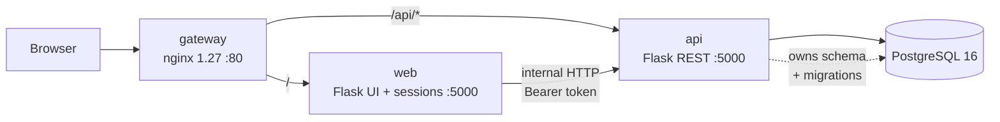

# Architecture of Kai Konane
## Structure
|   Service    | Responsibilities    |   Tech |   Talks to   |
|---|---|---|---|
| `gateway` | Reverse proxy and single public entrypoint. Routes `/api/*` to api, everything else to web. TLS in production. | nginx 1.27 (alpine) | web, api |
| `web` | UI only: templates, sessions, forms. Holds zero business logic and imports no ORM — every read and write goes to api over HTTP. | Flask + gunicorn | api |
| `api` | The domain: auth, activities, stories, learning plans, progress, results, rewards, feedback, preschools. Sole owner of the database and all migrations. | Flask + SQLAlchemy + gunicorn | db |
| `db` | Persistence | PostgreSQL 16 (alpine) | — |

## Build status

The split is being done in stages so the app stays runnable at every commit.
This table is the honest picture of what exists today.

| Piece | State |
|---|---|
| `services/api` package, `create_app()` factory | **built** (#6) |
| `/healthz`, `/readyz` | **built** (#6) |
| JSON serializers implementing the four rules | **built** (#7) |
| JSON content endpoints — activities, stories | **built** (#7) |
| JSON endpoints — auth, users, plans, progress, feedback, preschools | **built** (#7) |
| Contract tests over every endpoint (`test_api_content.py`, `test_api_domain.py`) | **built** (#7) |
| Rewards over JSON | deferred — write-only for now, see below |
| Bearer-token auth between `web` and `api` | **built** (#8) |
| `services/web` calling `api` over HTTP | **built** (#9) |
| Per-object authorisation in the api (`app/api/authz.py`) | **built** (#9) |
| `gateway`, Dockerfiles, compose | planned (#10) |

Until #9 lands, `api` also serves the HTML routes and owns `templates/` and
`static/`. That is deliberate: `services/web` cannot import `services/api`'s
models across the directory boundary, so splitting them before the HTTP layer
exists would leave the app broken for the whole middle of the branch. The
presentation assets move to `services/web` as part of #9.

## Repository layout

```
kai-konane/
├── docs/                       architecture, ADRs, images
├── gateway/                    nginx config + Dockerfile        (#10)
└── services/
    ├── api/
    │   ├── app/                the importable package
    │   │   ├── __init__.py     create_app() factory
    │   │   ├── config.py       settings + unbound extensions
    │   │   ├── models/         SQLAlchemy models — the only ORM in the repo
    │   │   ├── services/       domain logic
    │   │   ├── routes/         blueprints (HTML today, JSON from #7)
    │   │   ├── seeds/          idempotent seed data
    │   │   ├── cli.py          flask seed / check / init-db
    │   │   ├── level_predictor.py
    │   │   └── utils.py
    │   ├── templates/          moves to services/web in #9
    │   ├── static/             moves to services/web in #9
    │   ├── migrations/         alembic — owned by api alone
    │   ├── tests/
    │   ├── ml_model.py         trains level_prediction_model.joblib
    │   └── requirements.txt
    └── web/                    UI service                        (#9)
```

Two placement rules worth stating, because both caused failures during #6:

- **`templates/` and `static/` sit beside the package, not inside it.** They
  belong to `web` and are only lodging with `api` until #9, so the factory
  passes both paths to `Flask()` explicitly. Without that, Flask looks under
  `app/` and every `render_template` fails.
- **`config.basedir` is the *service* directory** (`services/api`), not the
  package directory. `services/media.py` derives the upload path from it and
  `level_predictor.py` finds the `.joblib` through it.

## Design rules

**Only `api` opens a database connection.** The acceptance test is a grep that
returns nothing:

```bash
grep -rn "sqlalchemy\|from models" services/web/
```

### Application factory

`api` is built by `create_app(overrides=None)` rather than a module-level app
object. Three consequences that are easy to get wrong:

- **Extensions are created unbound** in `config.py` (`db = SQLAlchemy()`,
  `migrate`, `login_manager`) and attached inside the factory with
  `init_app(app)`. Binding them at import time is what makes a factory
  impossible.
- **Blueprints are imported inside the factory**, never at module scope.
  `routes` imports `models`, `models` imports `config`; a top-level chain
  closes that loop and raises on startup.
- **CLI commands are plain `@click.command` + `@with_appcontext`**, registered
  by `register_cli(app)`. `@app.cli.command` needs a concrete app and cannot
  survive a factory.

`overrides` is how tests inject `TESTING` and a throwaway database URI without
touching the environment.

### Serialization

`web` renders templates from JSON, not from ORM objects. Four rules make that survivable, each one derived from a template that breaks silently without it.

| Type | Wire format | Why |
|---|---|---|
| Datetime | ISO 8601 string | JSON has no datetime. `web` registers one `\|datetime` Jinja filter; five `.strftime()` call sites depend on it. |
| Enum | `{"name": "BEGINNER", "value": "BEGINNER", "rank": 0}` | ~20 templates read `.name` or `.value`; `rank` carries sort order that `.value` cannot (alphabetically ADVANCED sorts before BEGINNER). |
| Relations | Embedded per the Embeds column, never id-only | Templates traverse two levels: `result.activity.stem_code`, `progress.learning_content.type`. |
| Money/score | Plain number | No formatting decisions in the api. |

**Enum comparison rule.** In Jinja, a Python enum compared to a dict is always
`False` and raises nothing — the dropdown simply stops preselecting. Every
identity comparison compares `.name` to `.name`:

```jinja
selected
```


### Authentication

1. `web` serves `GET/POST /users/login` as an HTML form. It never sees a password hash.
2. It posts credentials to `POST /auth/login`. `api` verifies and returns the user payload plus a signed token (`itsdangerous`).
3. `web` stores the user id and token in its Flask session cookie.
4. `web`'s `user_loader` calls `GET /users/{id}` with the token and builds a `SessionUser(UserMixin)` — not an ORM object. The result is cached in `flask.g` so it fires once per request, not once per `current_user` reference.
5. `web` defines its own four-member `Role` enum. Duplicating a protocol constant across a service boundary is correct; sharing a code module would not be.
6. Every endpoint marked **Token** requires `Authorization: Bearer`. The gateway exposes `/api/*` publicly, so network-level trust is not sufficient.

**Known consequence:** one internal hop per request to rehydrate the session user. Redis-backed sessions would remove it — see the roadmap.

## API contract

`api` serves all of these under `/api/*` via the gateway. **Auth** = requires a
`Authorization: Bearer` token. **Embeds** = related objects that must be nested
in the response, derived from the deepest attribute chain in the consuming
template.

### The `/api` prefix is not stripped

The api mounts its JSON blueprint at `/api` **internally**, and the gateway
forwards without stripping the prefix:

```nginx
location /api/ {
  proxy_pass http://api:5000;   # no trailing slash -- keeps /api
}
```

A trailing slash on `proxy_pass` would strip it, so the api would receive
`/activities`. That is unusable during the transition, because the HTML routes
still own `/activities` and `/stories` until #9 and the two would collide. It is
also simply easier to reason about: a path is identical whether you curl the api
directly or go through the gateway.

### Error shape

Every error is `{"error": "<message safe to show a user>"}` with the status
carried by the `ServiceError` subclass — `ValidationError` 400, `NotFound` 404,
`Conflict` 409. Routes raise; a blueprint error handler converts. No route needs
a try/except.

Routing failures (404, 405) are handled **app-wide** with a path check, not on
the blueprint. URL matching happens before Flask knows which blueprint owns a
path, so `@api_bp.errorhandler(404)` never fires for an unmatched `/api` path
and the client would get Flask's HTML error page.

### Tokens

`app/api/auth_seam.py` holds the whole of it: `issue_token`, `read_token` and
the `@token_required` decorator. Every endpoint the contract marks **Token**
carries the decorator, and a missing one is caught by the parametrised list in
`tests/test_api_auth.py`.

**Signed, not encrypted.** The token is an `itsdangerous` payload carrying
`{uid, role}`. The signature proves the api issued it and that nobody edited it;
it does **not** hide the contents, which are trivially readable by anyone
holding the token. Nothing may go in the claims that the bearer should not see.

**Not a JWT.** A JWT would add a dependency and a header of algorithm
negotiation to solve a problem this system does not have: there is one issuer,
one verifier and a shared secret. `itsdangerous` is already a Flask dependency,
and the part that matters — `max_age` enforced at load time, so an old token
cannot be replayed — is built in.

**`API_TOKEN_SECRET` is separate from `SECRET_KEY`.** `SECRET_KEY` signs `web`'s
session cookie; `API_TOKEN_SECRET` signs api tokens. Different trust boundaries,
so rotating one must not force rotating the other, and a leak of the cookie key
must not let anyone mint api tokens. Only `api` ever holds it — `web` replays a
token it was given and never signs one. Both are required in production; in
development the token secret falls back to `SECRET_KEY`.

Signatures are also salted (`kai-konane-api-token`), so a token minted for some
other purpose under the same secret cannot be replayed against the api.

**Tokens expire after `API_TOKEN_TTL_S`** (default 12 hours). `web` must treat a
401 as *log in again*, never as *retry* — an expired token plus a retry loop is
an infinite loop.

**What this is not.** `token_required` proves *who is calling*, not *what they
may touch*. That second question is answered by `app/api/authz.py` — see below.

### Authorisation

`token_required` establishes identity; `app/api/authz.py` decides what that
identity may touch. Both are needed, and having only the first is what made the
following possible before #9:

```
PARENT token (uid 3) → PATCH /api/users/1 {"password": "..."} → 200
                     → log in as admin with that password     → succeeds
```

Any signed-in user could rewrite any account, read any family's progress, and
rewrite the whole content library. Every endpoint was authenticated; none was
authorised.

Two rules the module is built on:

**Deny by default.** An unrecognised role gets nothing. The check this replaced
compared `role.name` to a lowercase string, never matched, and so allowed
everyone — a check that fails open is worse than no check at all, because it
reads like protection.

**Identity comes from the token, never the request.** `?parent_id=3` is a claim
by the caller; `g.current_user_id` is a claim the api signed. Only the second is
evidence. Scoping filters against the query string rather than the token is what
turns a listing endpoint into a data leak.

| Rule | Applies to |
|---|---|
| Admin only | `GET /users`, `DELETE /users/{id}`, all content authoring, media upload, preschool writes |
| Self or admin | `PATCH /users/{id}`, `PATCH /parents/{id}`, `PATCH /teachers/{id}` |
| Own learner | anything naming a `child_id` — progress, results, plans, stem-levels, submissions |
| Own mail | feedback listing, reading, and sending as yourself |
| Correspondent | `GET /users/{id}` for someone you share a learner with |

`tests/test_api_authz.py` covers these from the attacker's side — every test
describes something that worked before the module existed — plus two that assert
the checks are not blanket, because the failure mode of a security patch is
locking out the people it was meant to protect.

### Unauthenticated by necessity

Four endpoints stay open, and have to be:

| Endpoint | Why |
|---|---|
| `POST /auth/login` | Issues the token; requiring one is circular |
| `GET /users/availability` | The signup wizard runs before an account exists |
| `POST /parents`, `POST /teachers` | Registration — same reason |
| `GET /preschools` | The wizard offers a preschool at step 3 |

These are the only unauthenticated writes in the api. The exposure is the same
as any public signup form, but it is a deliberate decision rather than an
oversight, so it is recorded here.

### Exposed answer keys

`GET /api/activities/{id}` includes `answers[].is_correct`, because
`activity_page.html` uses it to play the right sound on selection. Scoring is
server-side, so this does not let a child forge a score — but it does let anyone
reading the payload see the answers. Fixing it properly means checking answers
one at a time server-side. Recorded here rather than fixed; it predates the
split.

### Auth and registration

| Method | Path | Purpose | Auth | Embeds | Called by (web) |
|---|---|---|---|---|---|
| POST | `/auth/login` | Verify credentials, issue token | — | role, type, profile fields | `user.login` |
| GET | `/users/availability` | Is this username/email free? | — | — | `user.parent_signup_2`, `user.teacher_signup_2` |
| POST | `/parents` | Create parent + N children + N plans, one transaction | — | children[] | `user.parent_signup_4` |
| POST | `/teachers` | Create teacher | — | — | `user.teacher_signup_3` |

### Users

| Method | Path | Purpose | Auth | Embeds | Called by (web) |
|---|---|---|---|---|---|
| GET | `/users/{id}` | Rehydrate the session user | Token | role, children[] or students[] | `user.load_user` |
| GET | `/users` | List all users (account fields only) | Admin | — | `admin.view_user_data` |
| PATCH | `/users/{id}` | Update username, email or password | Token | — | `admin.edit_user`, `profile.update_profile` |
| DELETE | `/users/{id}` | Delete a user | Admin | — | `admin.delete_user` |
| GET | `/parents/{id}/children` | A parent's children | Token | profile fields | `user.view_children`, `profile.profile` |
| PATCH | `/parents/{id}` | Update a parent's profile | Token | — | `profile.update_profile` |
| GET | `/teachers` | List teachers, to pick one per child at signup | Token | — | `user.parent_signup_3` |
| GET | `/teachers/{id}/students` | A teacher's learners | Token | profile fields | `user.view_learners`, `learning_plan.manage_learning_plans` |
| PATCH | `/teachers/{id}` | Update a teacher's profile | Token | — | `profile.update_profile` |
| GET | `/children` | List, filtered by `?parent_id=` or `?teacher_id=` | Token | profile fields | `user.view_children`, `user.view_learners` |
| GET | `/children/{id}` | One child | Token | profile fields | `profile.child_profile` |
| PATCH | `/children/{id}` | Update a child's profile | Token | — | `profile.update_child_profile` |

A child's learning plan is **not** embedded in these payloads even though several
templates show a plan next to a name. Embedding it would make every list view
carry five enums per child that most callers ignore, and a plan changes on a
different schedule to a profile. `GET /learning-plans/child/{id}` is a separate
call for that reason.

### Preschools

| Method | Path | Purpose | Auth | Embeds | Called by (web) |
|---|---|---|---|---|---|
| GET | `/preschools` | List (also used during signup) | — | — | `user.parent_signup_3`, `user.teacher_signup_1`, `preschool.view_preschools` |
| POST | `/preschools` | Create | Admin | — | `preschool.add_preschool` |
| GET | `/preschools/{id}` | Detail | Admin | students[], teachers[] | `preschool.view_preschool` |
| PATCH | `/preschools/{id}` | Rename | Admin | — | `preschool.edit_preschool` |
| DELETE | `/preschools/{id}` | Delete (rejects if occupied) | Admin | — | `preschool.delete_preschool` |

### Activities

| Method | Path | Purpose | Auth | Embeds | Called by (web) |
|---|---|---|---|---|---|
| GET | `/activities?child_id=` | List, filtered by the child's per-strand levels | Token | level, stem_code, progress | `activity.activity_home` |
| GET | `/activities/{id}` | Detail | Token | questions[].answers[] | `activity.activity_detail`, `activity.start_activity`, `admin.update_activity` |
| POST | `/activities` | Create | Admin | — | `admin.add_activity` |
| PATCH | `/activities/{id}` | Update, syncing questions and answers | Admin | questions[].answers[] | `admin.update_activity` |
| DELETE | `/activities/{id}` | Delete (cascades) | Admin | — | `admin.delete_activity` |
| POST | `/activities/{id}/submit` | Mark attempt, log result, nudge the plan | Token | — | `activity.submit_activity` |
| POST | `/activities/{id}/progress` | Save partial progress | Token | — | `activity.save_progress` |

### Stories

| Method | Path | Purpose | Auth | Embeds | Called by (web) |
|---|---|---|---|---|---|
| GET | `/stories?child_id=` | List, filtered by story level | Token | level, progress | `story.stories` |
| GET | `/stories/{id}` | Detail | Token | pages[] | `story.story_detail`, `admin.update_story` |
| POST | `/stories` | Create | Admin | — | `admin.add_story` |
| PATCH | `/stories/{id}` | Update, syncing and renumbering pages | Admin | pages[] | `admin.update_story` |
| DELETE | `/stories/{id}` | Delete (cascades) | Admin | — | `admin.delete_story` |
| POST | `/stories/{id}/progress` | Save page position | Token | — | `story.save_progress` |
| POST | `/stories/{id}/complete` | Mark complete, issue reward once | Token | — | `story.complete_story` |

### Learning plans

| Method | Path | Purpose | Auth | Embeds | Called by (web) |
|---|---|---|---|---|---|
| GET | `/learning-plans/child/{id}` | The plan | Token | 5 level enums | `learning_plan.view_learning_plan` |
| PUT | `/learning-plans/child/{id}` | Create or replace (one per child) | Teacher | — | `learning_plan.create_learning_plan`, `learning_plan.update_learning_plan` |
| GET | `/learning-plans/child/{id}/recommendations` | Content at or below each strand level | Token | level | `learning_plan.view_learning_plan` |

### Progress and results

| Method | Path | Purpose | Auth | Embeds | Called by (web) |
|---|---|---|---|---|---|
| GET | `/children/{id}/progress` | One child's progress | Token | learning_content{title, type} | `progress.parent_progress` |
| GET | `/progress?teacher_id=` | All a teacher's learners | Teacher | + child{firstname, lastname} | `progress.teacher_progress` |
| GET | `/children/{id}/results` | One child's attempts | Token | activity{title, stem_code} | `progress.parent_results` |
| GET | `/results?teacher_id=` | All a teacher's learners | Teacher | + child{firstname, lastname} | `progress.teacher_results` |
| GET | `/children/{id}/stem-levels` | Mean score per STEM strand | Token | — | `static/js/stem_graph.js` |

### Feedback

| Method | Path | Purpose | Auth | Embeds | Called by (web) |
|---|---|---|---|---|---|
| POST | `/feedback` | Send a message | Token | — | `feedback.submit_feedback` |
| GET | `/feedback?recipient_id=&unread=true` | Inbox | Token | sender{firstname, lastname} | `feedback.view_feedback` |
| GET | `/feedback?participant_id=` | Full history, sent and received | Token | sender{firstname, lastname} | `feedback.past_feedback` |
| GET | `/feedback/{id}` | Read one | Token | sender{firstname, lastname} | `feedback.read_feedback` |
| POST | `/feedback/{id}/read` | Mark as read | Token | — | `feedback.read_feedback` |

### Health

| Method | Path | Purpose | Auth | Embeds | Called by |
|---|---|---|---|---|---|
| GET | `/healthz` | Liveness — process is up. Never touches the database, so a slow query cannot look like a dead process and get the container killed. Returns `status`, `version`, `uptime_s`. | — | — | compose healthcheck, UptimeRobot |
| GET | `/readyz` | Readiness — the database answers. `503` when it does not. This is what compose `depends_on` waits for. | — | — | compose healthcheck |

### Registering a family

`POST /parents` is the one endpoint that creates several rows at once. The
four-step wizard lives entirely in `web`: steps 1–3 accumulate session state and
write nothing; step 4 posts the whole aggregate.

```json
POST /parents        →  201 Created
{
  "username": "pania", "email": "p@x.com", "password": "...",
  "firstname": "Pania", "lastname": "Rewi",
  "education_level": "BACHELORS_DEGREE",
  "preschool_id": 1,
  "children": [
    { "firstname": "Ari", "age": 5, "gender": "Female",
      "username": "ari", "password": "...",
      "race_ethnicity": "group B", "lunch_type": "STANDARD",
      "teacher_id": 3 }
  ]
}
```

Either the whole family is created or none of it is. A half-registered family
would leave children with no learning plan, and a child with no plan can see no
content at all — the app would appear to work and show an empty library. Every
child spec is validated before the first `INSERT`, so a bad second child does not
leave the parent and the first child behind.

Uniqueness is checked twice on purpose. `GET /users/availability` is **advisory**
— it exists so a four-screen wizard can fail on screen two instead of screen
four — and `RegistrationService` re-checks inside the transaction and raises
`Conflict` (409). Treating the advisory check as authoritative is a race.

### Rewards stay write-only

Rewards are issued by `POST /stories/{id}/complete` and never read back. There is
no `GET /rewards` in the contract because nothing displays them yet: whether
they surface as badges on the child's home screen is an open product decision. A
read endpoint added now would be a guess at the shape that screen needs, and a
wrong guess in the contract is more expensive than a missing one.

### Failure responses

Every endpoint fails through the same three mappings, so `web` needs one error
path, not thirty:

| Status | Raised by | Example |
|---|---|---|
| 400 | `ValidationError` | `{"error": "teacher_id must be a number"}` |
| 401 | `POST /auth/login` only | `{"error": "Invalid username or password"}` |
| 404 | `NotFound`, or no such route | `{"error": "No such user"}` |
| 409 | `Conflict` | `{"error": "Username 'parent' is already taken"}` |

The 401 message is deliberately identical for an unknown username and a wrong
password. Distinguishing them turns the login form into a username oracle.

## Mermaid diagram

## Web routes
`web` keeps all 70 HTML routes. This table is the completeness check: every
blueprint either calls api endpoints from the contract above, or renders a
static page. A blueprint that needs data with no matching endpoint means the
contract is incomplete.
| Blueprint | Routes | Calls |
|---|---|---|
| `user` | 20 | `POST /auth/login`, `GET /users/availability`, `POST /parents`, `POST /teachers`, `GET /users/{id}`, `GET /preschools`, `GET /teachers/{id}/students` |
| `admin` | 13 | activities and stories CRUD, `GET /users`, `PATCH /users/{id}`, `DELETE /users/{id}` |
| `feedback` | 7 | the five `/feedback` endpoints, `GET /parents/{id}/children` |
| `preschool` | 5 | the five `/preschools` endpoints |
| `activity` | 5 | `GET /activities`, `GET /activities/{id}`, `POST /activities/{id}/submit`, `POST /activities/{id}/progress` |
| `progress` | 5 | the four progress/results endpoints, `GET /children/{id}/stem-levels` |
| `story` | 4 | `GET /stories`, `GET /stories/{id}`, `POST /stories/{id}/progress`, `POST /stories/{id}/complete` |
| `learning_plan` | 4 | the three `/learning-plans` endpoints, `GET /teachers/{id}/students` |
| `profile` | 3 | `PATCH /users/{id}`, `PATCH /children/{id}`, `GET /parents/{id}/children` |
| `learning_content` | 1 | none — static menu page |
| `index` / `healthz` | 2 | none |

## Migration notes

### `/api/child_stem_levels` must move

`web` currently serves `GET /api/child_stem_levels/<child_id>`. Once the gateway
is in front, nginx matches the `/api/` prefix and forwards it to `api`, which
has no such route — the parent and teacher progress charts 404 from a service
that was never touched.

It already returns JSON, so it moves nearly verbatim to
`GET /children/{id}/stem-levels`. `static/js/stem_graph.js` must change with it:

```js
fetch(`/api/children/${childId}/stem-levels`)
```

### Case-sensitive template paths

Container filesystems are case-sensitive; Windows is not. Verify every
`render_template()` string matches the file on disk exactly before building
images. `view_learning_Plan.html` was caught this way — it worked on NTFS and
would have been a `TemplateNotFound` inside the container.

### What broke during #6, and will again during #9

The api move surfaced four failures that `git mv` cannot warn about. #9 moves
`routes/`, `templates/` and `static/` into `services/web`, so expect the same
shapes:

| Symptom | Cause |
|---|---|
| `ImportError: cannot import name 'app'` | Modules bound to a module-level `app` at import time — `login_manager.init_app(app)`, `@app.cli.command`. Both had to move into the factory. |
| Every `render_template` 500s | `Flask(__name__)` looks for `templates/` inside the package. Pass `template_folder` and `static_folder` explicitly. |
| A feature silently degrades | `level_predictor.py` resolved the `.joblib` beside itself. After the move the file was gone, prediction returned `None`, and every child silently fell back to `BEGINNER`. Seeding still reported success — **the exit code was zero**. Path-dependent assets must resolve through `config.basedir`, not `__file__`. |
| `NameError: name 'routes' is not defined` | A sed-based import rewrite turned `import routes` into `import app.routes`, which binds `app`, not `routes`. `from X import Y` rewrites safely; `import X` plus `X.attr` does not. |

The third is the one to watch for. A move that breaks an import fails loudly; a
move that breaks a *path* returns a default and keeps going. After #9, verify
behaviour, not just exit codes.