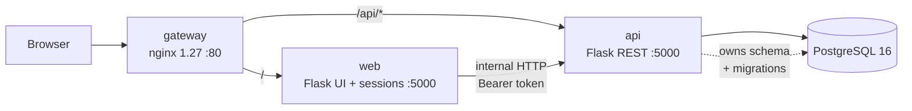

# Architecture of Kai Konane
## Structure
|   Service    | Responsibilities    |   Tech |   Talks to   |
|---|---|---|---|
| `gateway` | Reverse proxy and single public entrypoint. Routes `/api/*` to api, everything else to web. TLS in production. | nginx 1.27 (alpine) | web, api |
| `web` | UI only: templates, sessions, forms. Holds zero business logic and imports no ORM — every read and write goes to api over HTTP. | Flask + gunicorn | api |
| `api` | The domain: auth, activities, stories, learning plans, progress, results, rewards, feedback, preschools. Sole owner of the database and all migrations. | Flask + SQLAlchemy + gunicorn | db |
| `db` | Persistence | PostgreSQL 16 (alpine) | — |

## Design rules
**Design rule:** only `api` opens a database connection. The acceptance test is a grep that returns nothing:
grep -rn "sqlalchemy|from models" services/web/

### Serialization

`web` renders templates from JSON, not from ORM objects. Four rules make that survivable, each one derived from a template that breaks silently without it.

| Type | Wire format | Why |
|---|---|---|
| Datetime | ISO 8601 string | JSON has no datetime. `web` registers one `\|datetime` Jinja filter; five `.strftime()` call sites depend on it. |
| Enum | `{"name": "BEGINNER", "value": "BEGINNER", "rank": 0}` | ~20 templates read `.name` or `.value`; `rank` carries sort order that `.value` cannot (alphabetically ADVANCED sorts before BEGINNER). |
| Relations | Embedded per the Embeds column, never id-only | Templates traverse two levels: `result.activity.stem_code`, `progress.learning_content.type`. |
| Money/score | Plain number | No formatting decisions in the api. |

**Enum comparison rule.** In Jinja, a Python enum compared to a dict is always
`False` and raises nothing. Every identity comparison compares `.name` to `.name`: 
selected


### Authentication

1. `web` serves `GET/POST /users/login` as an HTML form. It never sees a password hash.
2. It posts credentials to `POST /auth/login`. `api` verifies and returns the user payload plus a signed token (`itsdangerous`).
3. `web` stores the user id and token in its Flask session cookie.
4. `web`'s `user_loader` calls `GET /users/{id}` with the token and builds a `SessionUser(UserMixin)` — not an ORM object. The result is cached in `flask.g` so it fires once per request, not once per `current_user` reference.
5. `web` defines its own four-member `Role` enum. Duplicating a protocol constant across a service boundary is correct; sharing a code module would not be.
6. Every endpoint marked **Token** requires `Authorization: Bearer`. The gateway exposes `/api/*` publicly, so network-level trust is not sufficient.

**Known consequence:** one internal hop per request to rehydrate the session user. Redis-backed sessions would remove it — see the roadmap.

## API contract

`api` serves all of these under `/api/*` via the gateway. **Auth** = requires a
`Authorization: Bearer` token. **Embeds** = related objects that must be nested
in the response, derived from the deepest attribute chain in the consuming
template.

### Auth and registration

| Method | Path | Purpose | Auth | Embeds | Called by (web) |
|---|---|---|---|---|---|
| POST | `/auth/login` | Verify credentials, issue token | — | role, type, profile fields | `user.login` |
| GET | `/users/availability` | Is this username/email free? | — | — | `user.parent_signup_2`, `user.teacher_signup_2` |
| POST | `/parents` | Create parent + N children + N plans, one transaction | — | children[] | `user.parent_signup_4` |
| POST | `/teachers` | Create teacher | — | — | `user.teacher_signup_3` |

### Users

| Method | Path | Purpose | Auth | Embeds | Called by (web) |
|---|---|---|---|---|---|
| GET | `/users/{id}` | Rehydrate the session user | Token | role, children[] or students[] | `user.load_user` |
| GET | `/users` | List all users | Admin | — | `admin.view_user_data` |
| PATCH | `/users/{id}` | Update username/email/password/role | Token | — | `admin.edit_user`, `profile.update_profile` |
| DELETE | `/users/{id}` | Delete a user | Admin | — | `admin.delete_user` |
| GET | `/parents/{id}/children` | A parent's children | Token | learning_plan | `user.view_children`, `profile.profile` |
| GET | `/teachers/{id}/students` | A teacher's learners | Token | learning_plan | `user.view_learners`, `learning_plan.manage_learning_plans` |
| PATCH | `/children/{id}` | Update a child's profile | Token | — | `profile.update_child_profile` |

### Preschools

| Method | Path | Purpose | Auth | Embeds | Called by (web) |
|---|---|---|---|---|---|
| GET | `/preschools` | List (also used during signup) | — | — | `user.parent_signup_3`, `user.teacher_signup_1`, `preschool.view_preschools` |
| POST | `/preschools` | Create | Admin | — | `preschool.add_preschool` |
| GET | `/preschools/{id}` | Detail | Admin | students[], teachers[] | `preschool.view_preschool` |
| PATCH | `/preschools/{id}` | Rename | Admin | — | `preschool.edit_preschool` |
| DELETE | `/preschools/{id}` | Delete (rejects if occupied) | Admin | — | `preschool.delete_preschool` |

### Activities

| Method | Path | Purpose | Auth | Embeds | Called by (web) |
|---|---|---|---|---|---|
| GET | `/activities?child_id=` | List, filtered by the child's per-strand levels | Token | level, stem_code, progress | `activity.activity_home` |
| GET | `/activities/{id}` | Detail | Token | questions[].answers[] | `activity.activity_detail`, `activity.start_activity`, `admin.update_activity` |
| POST | `/activities` | Create | Admin | — | `admin.add_activity` |
| PATCH | `/activities/{id}` | Update, syncing questions and answers | Admin | questions[].answers[] | `admin.update_activity` |
| DELETE | `/activities/{id}` | Delete (cascades) | Admin | — | `admin.delete_activity` |
| POST | `/activities/{id}/submit` | Mark attempt, log result, nudge the plan | Token | — | `activity.submit_activity` |
| POST | `/activities/{id}/progress` | Save partial progress | Token | — | `activity.save_progress` |

### Stories

| Method | Path | Purpose | Auth | Embeds | Called by (web) |
|---|---|---|---|---|---|
| GET | `/stories?child_id=` | List, filtered by story level | Token | level, progress | `story.stories` |
| GET | `/stories/{id}` | Detail | Token | pages[] | `story.story_detail`, `admin.update_story` |
| POST | `/stories` | Create | Admin | — | `admin.add_story` |
| PATCH | `/stories/{id}` | Update, syncing and renumbering pages | Admin | pages[] | `admin.update_story` |
| DELETE | `/stories/{id}` | Delete (cascades) | Admin | — | `admin.delete_story` |
| POST | `/stories/{id}/progress` | Save page position | Token | — | `story.save_progress` |
| POST | `/stories/{id}/complete` | Mark complete, issue reward once | Token | — | `story.complete_story` |

### Learning plans

| Method | Path | Purpose | Auth | Embeds | Called by (web) |
|---|---|---|---|---|---|
| GET | `/learning-plans/child/{id}` | The plan | Token | 5 level enums | `learning_plan.view_learning_plan` |
| PUT | `/learning-plans/child/{id}` | Create or replace (one per child) | Teacher | — | `learning_plan.create_learning_plan`, `learning_plan.update_learning_plan` |
| GET | `/learning-plans/child/{id}/recommendations` | Content at or below each strand level | Token | level | `learning_plan.view_learning_plan` |

### Progress and results

| Method | Path | Purpose | Auth | Embeds | Called by (web) |
|---|---|---|---|---|---|
| GET | `/children/{id}/progress` | One child's progress | Token | learning_content{title, type} | `progress.parent_progress` |
| GET | `/progress?teacher_id=` | All a teacher's learners | Teacher | + child{firstname, lastname} | `progress.teacher_progress` |
| GET | `/children/{id}/results` | One child's attempts | Token | activity{title, stem_code} | `progress.parent_results` |
| GET | `/results?teacher_id=` | All a teacher's learners | Teacher | + child{firstname, lastname} | `progress.teacher_results` |
| GET | `/children/{id}/stem-levels` | Mean score per STEM strand | Token | — | `static/js/stem_graph.js` |

### Feedback

| Method | Path | Purpose | Auth | Embeds | Called by (web) |
|---|---|---|---|---|---|
| POST | `/feedback` | Send a message | Token | — | `feedback.submit_feedback` |
| GET | `/feedback?recipient_id=&unread=true` | Inbox | Token | sender{firstname, lastname} | `feedback.view_feedback` |
| GET | `/feedback?participant_id=` | Full history, sent and received | Token | sender{firstname, lastname} | `feedback.past_feedback` |
| GET | `/feedback/{id}` | Read one | Token | sender{firstname, lastname} | `feedback.read_feedback` |
| POST | `/feedback/{id}/read` | Mark as read | Token | — | `feedback.read_feedback` |

### Health

| Method | Path | Purpose | Auth | Embeds | Called by |
|---|---|---|---|---|---|
| GET | `/healthz` | Liveness — process is up | — | — | compose healthcheck, UptimeRobot |

### Registering a family

`POST /parents` is the one endpoint that creates several rows at once. The
four-step wizard lives entirely in `web`: steps 1–3 accumulate session state and
write nothing; step 4 posts the whole aggregate.

```json
POST /parents        →  201 Created
{
  "username": "pania", "email": "p@x.com", "password": "...",
  "firstname": "Pania", "lastname": "Rewi",
  "education_level": "BACHELORS_DEGREE",
  "preschool_id": 1,
  "children": [
    { "firstname": "Ari", "age": 5, "gender": "Female",
      "username": "ari", "password": "...",
      "race_ethnicity": "group B", "lunch_type": "STANDARD",
      "teacher_id": 3 }
  ]
}
```

## Mermaid diagram

## Web routes
`web` keeps all 70 HTML routes. This table is the completeness check: every
blueprint either calls api endpoints from the contract above, or renders a
static page. A blueprint that needs data with no matching endpoint means the
contract is incomplete.
| Blueprint | Routes | Calls |
|---|---|---|
| `user` | 20 | `POST /auth/login`, `GET /users/availability`, `POST /parents`, `POST /teachers`, `GET /users/{id}`, `GET /preschools`, `GET /teachers/{id}/students` |
| `admin` | 12 | activities and stories CRUD, `GET /users`, `PATCH /users/{id}`, `DELETE /users/{id}` |
| `feedback` | 7 | the five `/feedback` endpoints, `GET /parents/{id}/children` |
| `preschool` | 5 | the five `/preschools` endpoints |
| `activity` | 5 | `GET /activities`, `GET /activities/{id}`, `POST /activities/{id}/submit`, `POST /activities/{id}/progress` |
| `progress` | 5 | the four progress/results endpoints, `GET /children/{id}/stem-levels` |
| `story` | 4 | `GET /stories`, `GET /stories/{id}`, `POST /stories/{id}/progress`, `POST /stories/{id}/complete` |
| `learning_plan` | 4 | the three `/learning-plans` endpoints, `GET /teachers/{id}/students` |
| `profile` | 3 | `PATCH /users/{id}`, `PATCH /children/{id}`, `GET /parents/{id}/children` |
| `learning_content` | 1 | none — static menu page |
| `index` / `healthz` | 2 | none |

## Migration notes

### `/api/child_stem_levels` must move

`web` currently serves `GET /api/child_stem_levels/<child_id>`. Once the gateway
is in front, nginx matches the `/api/` prefix and forwards it to `api`, which
has no such route — the parent and teacher progress charts 404 from a service
that was never touched.

It already returns JSON, so it moves nearly verbatim to
`GET /children/{id}/stem-levels`. `static/js/stem_graph.js` line 63 must change
with it: fetch(/api/children/${childId}/stem-levels)


### Case-sensitive template paths
Container filesystems are case-sensitive; Windows is not. Verify every
`render_template()` string matches the file on disk exactly before building
images.