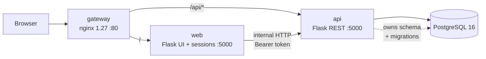

# Architecture of Kai Konane
## Structure
|   Service    | Responsibilities    |   Tech |   Talks to   |
|   gateway    | reverse proxy, single public entrypoint, routes /api/* vs UI, TLS in prod    |   nginx (alpine) |   web, api   |
|   web    | UI: templates, sessions, forms. Holds zero business logic - calls api over HTTP    |   Flask + gunicorn |   api   |
|   api    | The domain: auth, lessons/content, user progress. Owns database and all migrations    |   Flask + SQLAlchemy + gunicorn |   db   |
|   db    | persistence    |  PostgreSQL 16 (alpine) |   -  |
|   worker    | background jobs (emails, stats, rollups)    |   RQ + redis |   api, db   |

## main API routes
|   Method    | Path    |   Purpose |   Auth?   |   Embeds  |   Called by   |
|-------------|---------|-----------|-----------|-----------|---------------|
|   POST      | /auth/register |   Add credentials | No | role, type, subclass fields | web: user.register |
|   POST      | /auth/login |   Verify credentials, issue token | No | role, type, subclass fields | web: user.login |
|   GET      | /users/{id} |   Rehydrate session user | Token   | children[] or students[] | web: user_loader |
|   GET      | /activities |   List, filtered by level+strand | Token   | level, stem_code | web: activity_home |
|   GET      | /activities/{id} |   Detail with questions/answers | Token   | questions[].answers[] | web: start_activity |
|   POST      | /activities/{id}/submit |   Mark attempt, update learning plan | Token   | - | web: submit_activity |
|   POST      | /progress |   record a child's completion event | Token | progress | web: progress.submit |

## Mermaid diagram
